# 2. Proxy Server

## 2.1 Pengertian, Fungsi, dan Manfaat
### 2.1.1 Pengertian
Proxy server adalah sebuah server atau program komputer yang berperan sebagai penghubung antara suatu komputer dengan jaringan internet. Atau dalam kata lain, proxy server adalah suatu jaringan yang menjadi perantara antara jaringan lokal dan jaringan internet.

Proxy server dapat berupa suatu sistem komputer ataupun sebuah aplikasi yang bertugas menjadi gateway atau pintu masuk yang menghubungan komputer kita dengan jaringan luar.

### 2.1.2 Fungsi
1. ***Connection sharing*** :
Proxy bertindak sebagai gateway yang menjadi pembatas antara jaringan lokal dengan jaringan luar. Gateway bertindak juga sebagai sebuah titik dimana sejumlah koneksi dari pengguna lokal dan koneksi jaringan luar juga terhubung kepadanya. Oleh sebab itu, koneksi dari jaringan lokal ke internet akan menggunakan sambungan yang dimiliki oleh gateway secara bersama-sama (connecion sharing).
2. ***Filtering*** :
Proxy bisa difungsikan untuk bekerja pada layar aplikasi dengan demikian maka dia bisa berfungsi sebagai firewalll paket filtering yang dapat digunakan untuk melindungi jaringan lokal terhadap gangguan maupun ancaman serangan dari jaringan luar. Fungsi filtering ini juga dapat diatur atau dikonfigurasi untuk menolak akses terhadap situs web tertentu dan pada waktu- waktu tertentu juga.
3. ***Caching*** :
Sebuah proxy server mempunyai mekanisme penyimpanan obyek-obyek yang telah diminta dari server-server yang ada di internet. Dengan mekanisme caching ini maka akan menyimpan objek-objek yang merupakan berbagai permintaan/request dari para pengguna yang di peroleh dari internet.

### 2.1.3 Manfaat
Proxy server memiliki manfaat-manfaat berikut ini:
- Membagi koneksi
- Menyembunyikan IP
- Memblokir situs yang tidak diinginkan
- Mengakses situs yang telah diblokir
- Mengatur bandwith

### 2.1.4 Software Proxy Server
Beberapa contoh software proxy server yang sering digunakan adalah sebagai berikut:

1. CCProxy

2. WinGate

3. Squid

4. Nginx

## 2.2 Implementasi
Untuk praktikum jarkom kali ini, software proxy server yang digunakan adalah **SQUID**. UML yang digunakan sebagai proxy server adalah **PUCANG**.

### 2.2.1 Instalasi Squid
**STEP 1** - Pada UML **PUCANG**, ketikkan:

    apt-get install squid3

**STEP 2** - Cek status squid3 dengan mengetikkan 

    service squid3 status

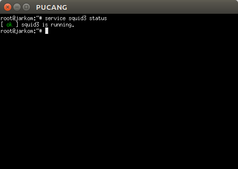

Jika muncul status **ok** maka instalasi telah berhasil.

### 2.2.2 Konfigurasi Dasar Squid
**STEP 1** - Backup terlebih dahulu file konfigurasi default yang disediakan squid. Ketikkan perintah berikut untuk melakukan backup: 

    mv /etc/squid3/squid.conf /etc/squid3/squid.conf.bak

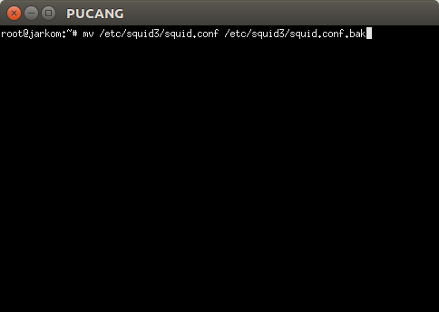

Perintah di atas artinya mengubah ekstensi file **squid.conf** menjadi **squid.conf.bak** dan menyimpannya di directory yang sama (tidak pindah folder).

**STEP 2** - Buat konfigurasi baru dengan mengetikkan:

    nano /etc/squid3/squid.conf
    

**STEP 3** - Kemudian, pada file config yang baru, ketikkan:

    http_port 8080
    visible_hostname pucang

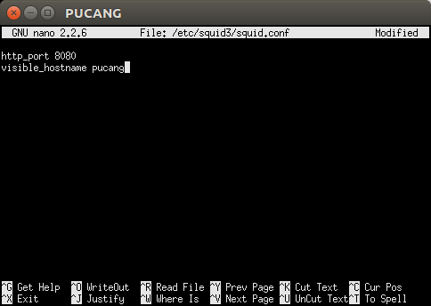

Konfigurasi di atas berarti:
- Menggunakan port 8080
- Nama yang akan terlihat pada status: pucang

**STEP 4** - Restart squid dengan cara mengetikkan perintah:

    service squid3 restart

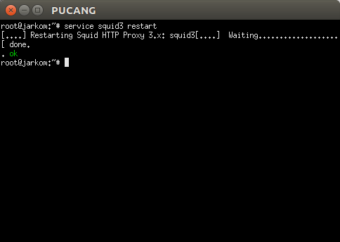

**STEP 5** - Ubah pengaturan proxy browser. Gunakan **IP PUCANG** sebagai host, dan isikan port **8080**.

**STEP 6** - Cobalah untuk mengakses web **its.ac.id** (usahakan menggunakan mode **incognito/private**). Seharusnya yang muncul adalah sebagai berikut.

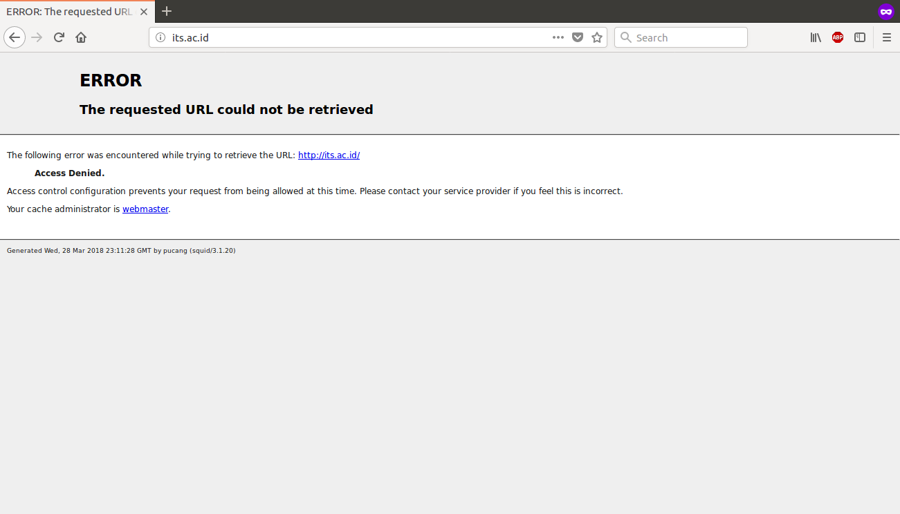

**STEP 7** - Supaya bisa mengakses web **its.ac.id**, buka kembali file konfigurasi squid yang sudah dibuat tadi

**STEP 8** - Tambahkan baris berikut.

    http_access allow all

**STEP 9** - **Simpan** file konfigurasi tersebut, lalu **restart** squid.

**STEP 10** - Refresh halaman web **its.ac.id**. Seharusnya halaman yang ditampilkan kembali normal.

Keterangan:
- **http_port 8080** berarti menggunakan port 8080 untuk mengakses proxy (Sintaks: **http_port PORT_YANG_DIINGINKAN**)
- **visible_hostname pucang** adalah sintaks untuk memberikan nama proxy yang dapat dilihat user (Sintaks: **visible_hostname NAMA_YANG_DIINGINKAN**)
- **http_access allow all** artinya memperbolehkan semuanya untuk mengakses proxy via http, perlu ditambahkan karena pengaturan default squid adalah **deny** (Sintaks: **http_access allow TARGET**)
- Untuk menolak koneksi, maka **allow** diganti dengan **deny**

### 2.2.3 Membuat User Login
**STEP 1** - Buat user dan password baru ke dalam squid. Ketikkan:

    htpasswd -c /etc/squid3/passwd jarkom204
    
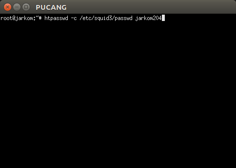

Ketikkan password yang diinginkan. Jika sudah maka akan muncul notifikasi:

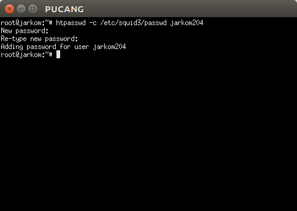

**STEP 2** - Edit konfigurasi squid menjadi:

    http_port 8080
    visible_hostname pucang
    
    auth_param basic program /usr/lib/squid3/ncsa_auth /etc/squid3/passwd
    auth_param basic children 5
    auth_param basic realm Proxy
    auth_param basic credentialsttl 2 hours
    auth_param basic casesensitive on
    acl USERS proxy_auth REQUIRED
    http_access allow USERS

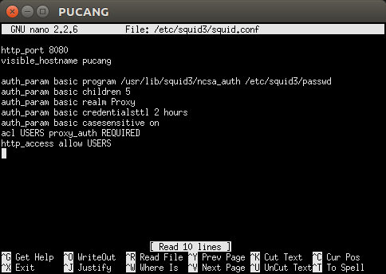

**STEP 3** - Restart squid

**STEP 4** - Ubah pengaturan proxy browser. Gunakan **IP PUCANG** sebagai host, dan isikan port **8080**.

**STEP 5** - Cobalah untuk mengakses web **elearning.if.its.ac.id** (usahakan menggunakan mode **incognito/private**). Seharusnya muncul pop-up untuk login.

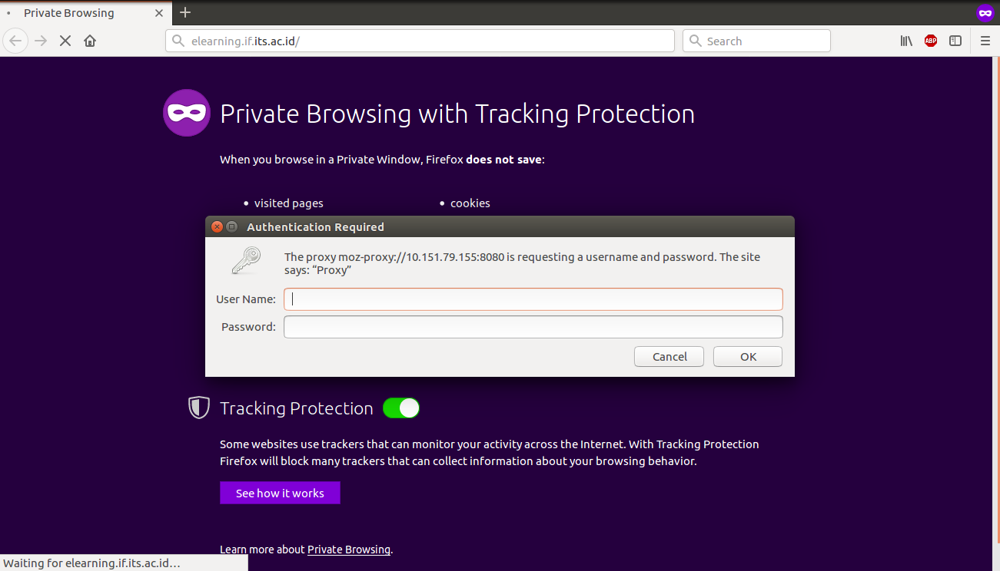

**STEP 6** - Isikan username dan password.

**STEP 7** - E-learning berhasil dibuka.

Keterangan:
- **auth_param** digunakan untuk mengatur autentikasi (Sintaks: **auth_param SCHEME PARAMETER SETTING**. Lebih lengkapnya di http://www.squid-cache.org/Doc/config/auth_param/).
- `program` : perintah untuk mendefiniskan autentikator eksternal.
- `children` : mendefinisikan jumlah maksimal autentikator muncul.
- `realm` : teks yang akan muncul pada pop-up autentikasi.
- `credentialsttl` : mengatur masa aktif suatu autentikasi berlaku.
- `casesensitive` : untuk mengatur apakah **username** bersifat case sensitive atau tidak.
- **acl** digunakan untuk mendefinisikan pengaturan akses tertentu. (Sintaks umum: **acl ACL_NAME ACL_TYPE ARGUMENT** . Lebih lengkapnya di http://www.squid-cache.org/Doc/config/acl/)
- Untuk melihat daftar apa saja yang bisa diatur dengan acl bisa diakses di: https://wiki.squid-cache.org/SquidFaq/SquidAcl)

### 2.2.4 Pembatasan Waktu Akses

Kita akan mencoba membatasi akses proxy pada hari dan jam tertentu. Asumsikan proxy dapat digunakan hanya pada hari **Senin** sampai **Jumat** pada jam **08.00-16.00**.

**STEP 1** - Buat file baru bernama **acl.conf** di folder **squid3**

    nano /etc/squid3/acl.conf

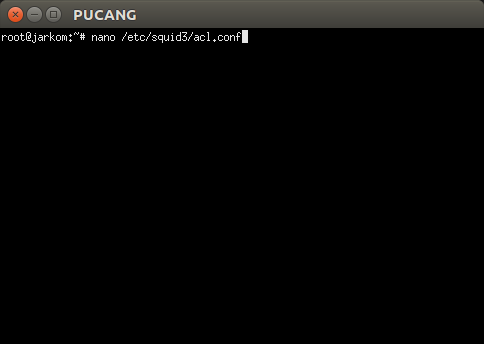

**STEP 2** - Tambahkan baris berikut

    acl KERJA time MTWHF 08:00-16:00

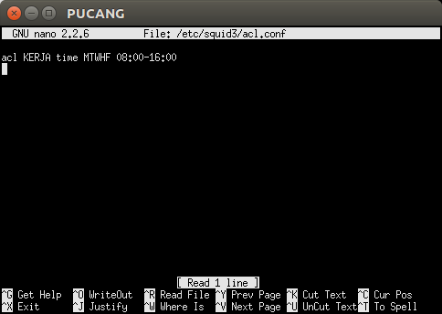

**STEP 3** - Simpan file acl.conf

**STEP 4** - Buka file **squid.conf**

    nano /etc/squid3/squid.conf

**STEP 5** - Ubah konfigurasinya menjadi:

    include /etc/squid3/acl.conf
    
    http_port 8080
    http_access allow KERJA
    http_access deny all
    visible_hostname pucang

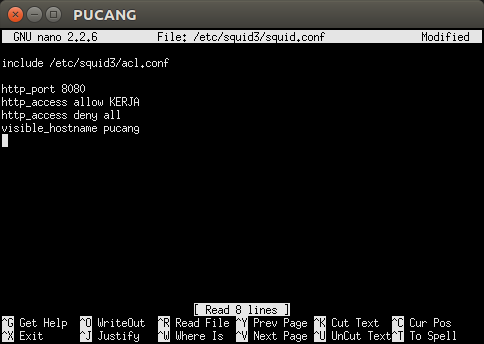

**STEP 6** - Simpan file tersebut. Kemudian restart squid

**STEP 7** - Cobalah untuk mengakses web **its.ac.id** (usahakan menggunakan mode **incognito/private**). Seharusnya muncul halaman error jika mengakses diluar waktu yang telah ditentukan.

Keterangan:
- **MTWHF** adalah kumpulan nama hari-hari dimana user diperbolehkan menggunakan proxy. (S: Sunday, M: Monday, T: Tuesday, W: Wednesday, H: Thursday, F: Friday, A: Saturday)
- Penulisan jam: **h1:m1-h2:m2**. Dengan syarat **h1<h2** dan **m1<m2**

### 2.2.5 Pembatasan Akses ke Website Tertentu

Kita akan mencoba membatasi akses ke beberapa website. Untuk contoh disini, kita akan memblokir website **E-Learning IF**

**STEP 1** - Buat file bernama **bad-sites.acl** di folder **squid3** dengan mengetikkan:

    nano /etc/squid3/bad-sites.acl
    
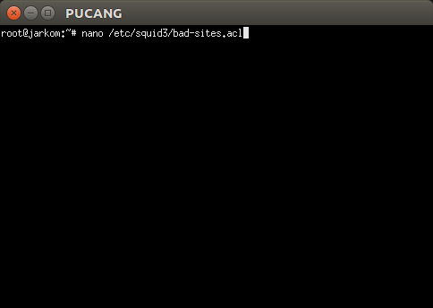

**STEP 2** - Tambahkan alamat url yang akan diblock seperti baris berikut:

    elearning.if.its.ac.id

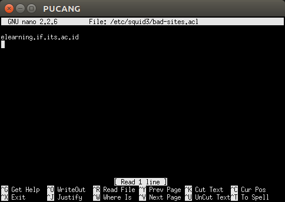

**STEP 3** - Ubah file konfigurasi squid menjadi seperti berikut ini.

    acl BLACKLISTS dstdomain "/etc/squid3/bad-sites.acl"
    http_access deny BLACKLISTS
    http_access allow all

**STEP 4** - Restart squid

**STEP 5** - Cobalah untuk mengakses web **elearning.if.its.ac.id** (usahakan menggunakan mode **incognito/private**). Seharusnya muncul halaman error seperti di bawah ini.

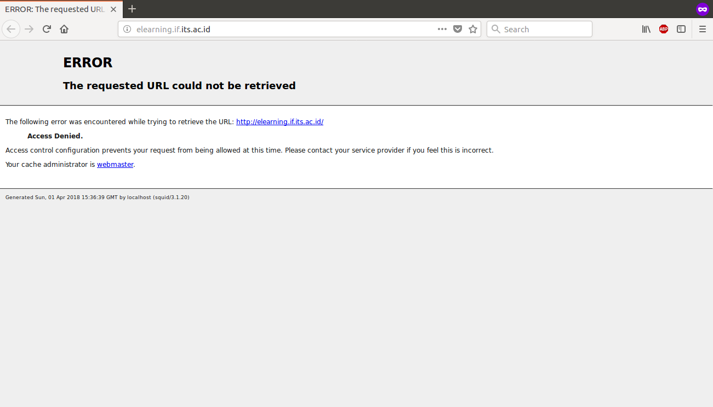

Keterangan:
- **dstdomain** artinya destination domain/domain tujuan. Sintaksnya bisa diikuti dengan nama domain tujuan atau file yang menampung list-list alamat website.

### 2.2.6 Pembatasan Bandwidth

Kita akan mencoba untuk membatasi bandwidth yang akan diberikan kepada user proxy. Untuk contoh disini kita akan membatasi penggunaannya maksimal 512 kbps.

**STEP 1** - Buat file bernama acl-bandwidth.conf di folder squid3

    nano /etc/squid3/acl-bandwidth.conf
    
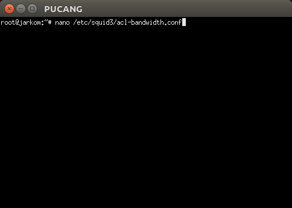

**STEP 2** - Ketikkan baris berikut

    delay_pools 1
    delay_class 1 1
    delay_access 1 allow all
    delay_parameters 1 16000/64000

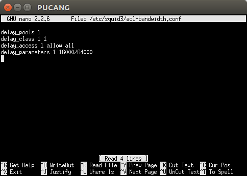

**STEP 3** - Ubah konfigurasi squid3 menjadi:

    include /etc/squid3/acl-bandwidth.conf
    http_port 8080
    http_access allow all

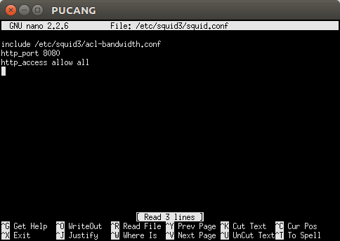

**STEP 4** - Restart Squid

**STEP 5** - Cobalah untuk mendownload file atau lakukan speed test. Berikut perbedaan sebelum dan sesudah adanya pembatasan bandwidth saat melakukan speed test

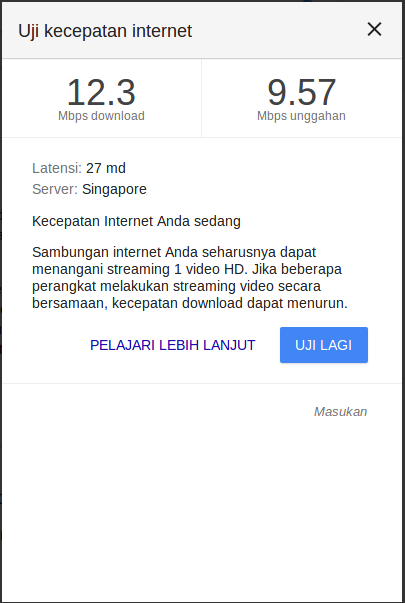 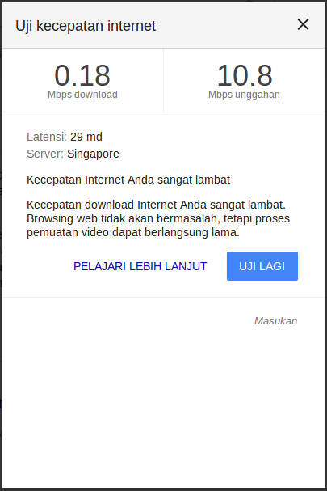

Keterangan:
- **delay_pools** digunakan untuk menentukan berapa pool yang akan dibuat. (Sintaks: **delay_pools JUMLAH_YANG_DIINGINKAN**. Lebih lengkap lihat di http://www.squid-cache.org/Doc/config/delay_pools/).
- **delay_class** digunakan untuk menentukan kelas dari pool yang telah dibuat. (Sintaks: **delay_class POOL_KE_BERAPA KELAS**.) Lebih lengkap lihat di http://www.squid-cache.org/Doc/config/delay_class/.
- **delay_access** mirip seperti http_access, tetapi digunakan untuk mengakses pool yang telah dibuat (Sintaks: **delay_access POOL_KE_BERAPA allow/deny TARGET**. Lebih lengkap lihat di http://www.squid-cache.org/Doc/config/delay_access/).
- **delay_parameters** digunakan untuk mengatur parameter dari pool yang telah dibuat. Sintaks berbeda-beda sesuai dengan kelas dari pool yang dibuat. Lebih lengkap lihat di http://www.squid-cache.org/Doc/config/delay_parameters/
- **16000/64000** artinya bandwidth pada kondisi normal (trafik banyak) adalah 16000 Bps (128 kbps) dan pada saat kondisi kosong (tidak ada trafik lain) adalah 64000 Bps (512 kbps)
- Penjelasan dari fitur **delay_pools** lebih lengkap bisa dilihat di https://wiki.squid-cache.org/Features/DelayPools

## 2.3 Soal Latihan
Mocatfrio adalah seorang mahasiswi Informatika ITS. Dia ingin membuat sebuah proxy sendiri. Proxy yang akan dibuat nantinya harus bisa diakses dengan nama **proxy.xxx.id** dan port yang digunakan **8080**. Dia ingin ada login terlebih dahulu saat menggunakan proxy. Untuk akun yang akan digunakan untuk dirinya sendiri, dia ingin menggunakan username **mocatfrio** dan password **n0-madeN**. Proxy ini nantinya hanya bisa digunakan saat mocatfrio sedang ada kelas. Jadwal kelas mocatfrio adalah Senin, Rabu, dan Kamis mulai jam 7 pagi sampai jam 4 sore. Kemudian, dia ingin membatasi agar hanya user dari **Informatics_wifi** saja yang bisa menggunakan proxy tersebut. Lalu, dia teringat kalau dulu dia pernah ditolak masuk Unair. Oleh karena itu dia memutuskan untuk memblokir website Unair (unair.ac.id) beserta seluruh subdomain yang ada. Supaya adil, dia ingin agar seluruh user mendapatkan bandwidth yang sama. Yaitu 512 kbps pada saat normal dan 1 Mbps pada saat kosong.

Karena mocatfrio ternyata sangat sibuk, maka dia meminta bantuan kalian untuk membuatkan proxy seperti yang dia minta. Cobalah untuk memenuhi permintaan mocatfrio supaya mocatfrio merasa senang.

Keterangan:
- **xxx** adalah kelompok kalian masing-masing. Misal: **c01**
- **Informatics_wifi** : 10.151.252.0/22
